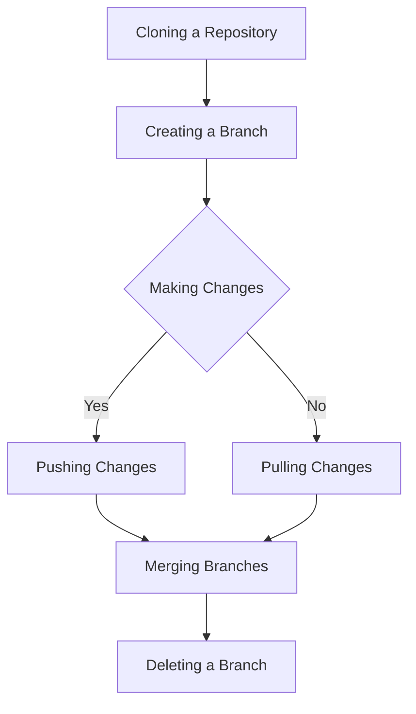

## USER
Summarize this article, and another page at the bottom of the left-side navigator for "Git Good Articles" to link articles like this:   
Basic Concepts Explained
1. Repository
Think of a repository as a special folder that holds all your code and its history. It’s like a magic box that keeps track of every change you make.

2. Commit
A commit is like taking a snapshot of your code at a specific moment. It’s a way of saying, “Hey, I made some changes, and here they are!” Each commit has a unique ID and a message explaining what you did.

3. Branch
A branch is like a separate playground where you can work on new features without messing up the main code. By default, there’s usually a branch called “main” or “master.”

4. Remote
A remote is like a connection to a server where your code is stored. It could be on a platform like GitHub or GitLab. Remotes help you collaborate with others.

Basic Commands for Beginners

1. Cloning a Repository
To copy a project from a remote server to your computer, use:

git clone <repository_url>

2. Creating a Branch
To start working on a new feature, create a branch:

git checkout -b new_feature
or using the newer git switch:

git switch -c new_feature

3. Making Changes
After making changes to your code, save them and let Git know:

git add .
Then, commit your changes:

git commit -m "Description of what you did"

4. Pushing Changes
To share your changes with others on the remote server:

git push origin your_branch_name

5. Pulling Changes
To get the latest changes made by others:

git pull origin your_branch_name

6. Merging Branches
To bring your changes back to the main code:

git merge your_feature_branch

7. Deleting a Branch
When you’re done with a feature branch:

git branch -d your_feature_branch

Then add a mermaid.js diagram of the above.

## ASSISTANT
The provided article explains basic concepts and commands in Git:

**Basic Concepts Explained:**
1. **Repository**: It's a special folder that holds all code and its history, acting like a magic box tracking every change.
2. **Commit**: Represents a snapshot of code at a specific moment, each with a unique ID and a message.
3. **Branch**: A separate playground for working on new features without affecting the main code, often starting with a default branch like "main" or "master."
4. **Remote**: Acts as a connection to a server storing code, facilitating collaboration, typically found on platforms like GitHub or GitLab.

**Basic Commands for Beginners:**
1. **Cloning a Repository**: Copies a project from a remote server to the local computer using `git clone <repository_url>`.
2. **Creating a Branch**: Begins work on a new feature by creating a branch with either `git checkout -b new_feature` or `git switch -c new_feature`.
3. **Making Changes**: After altering code, save changes with `git add .` and commit them with `git commit -m "Description of what you did"`.
4. **Pushing Changes**: Shares changes with others on the remote server using `git push origin your_branch_name`.
5. **Pulling Changes**: Retrieves the latest changes made by others with `git pull origin your_branch_name`.
6. **Merging Branches**: Combines changes back into the main codebase with `git merge your_feature_branch`.
7. **Deleting a Branch**: Removes a feature branch when it's no longer needed with `git branch -d your_feature_branch`.

For the mermaid.js diagram, unfortunately, I cannot render images. You can use the following mermaid code to generate the diagram:

This diagram illustrates the flow of basic Git commands, showing how they connect and interact with each other.